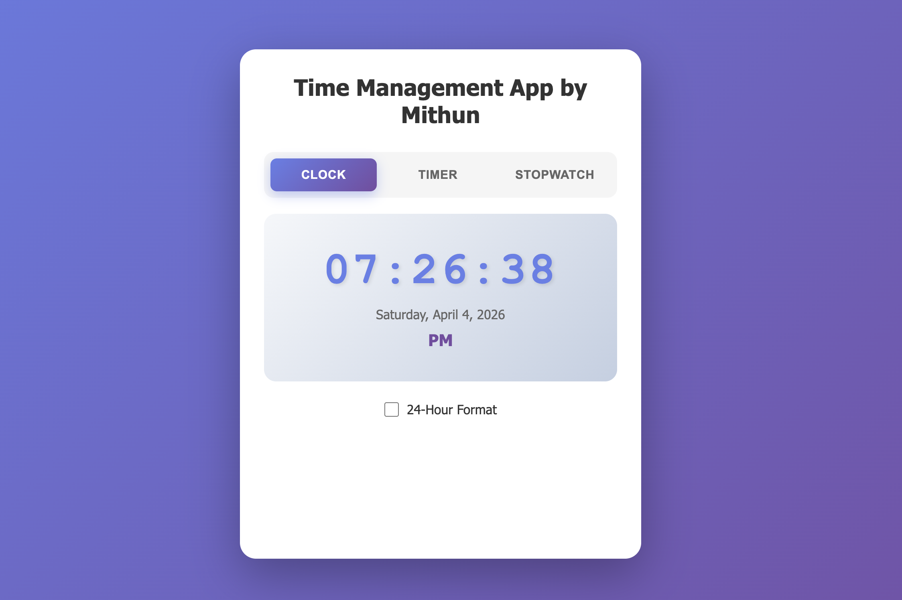
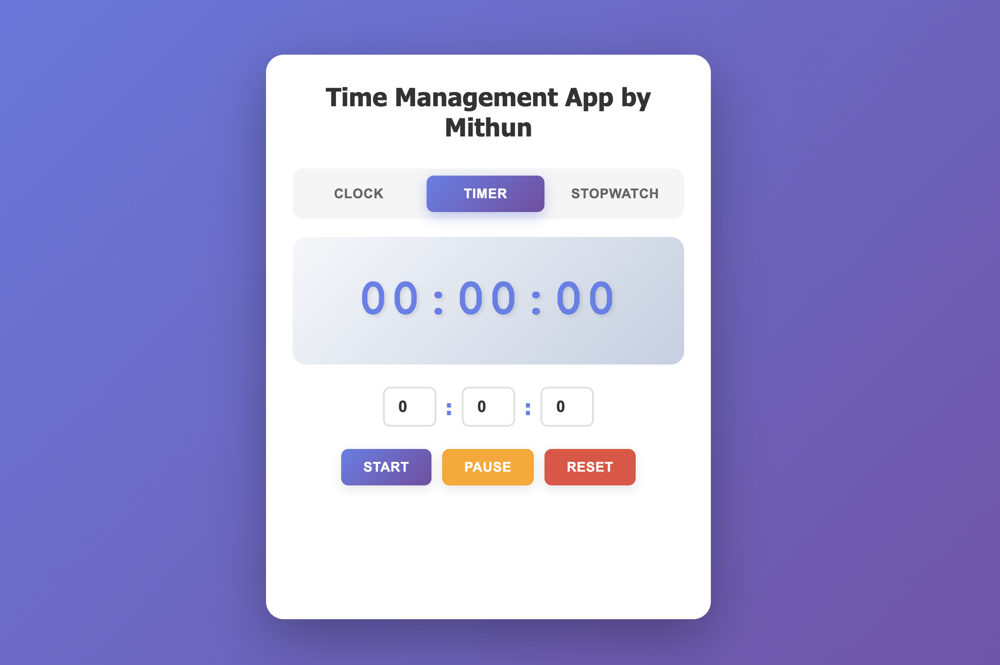
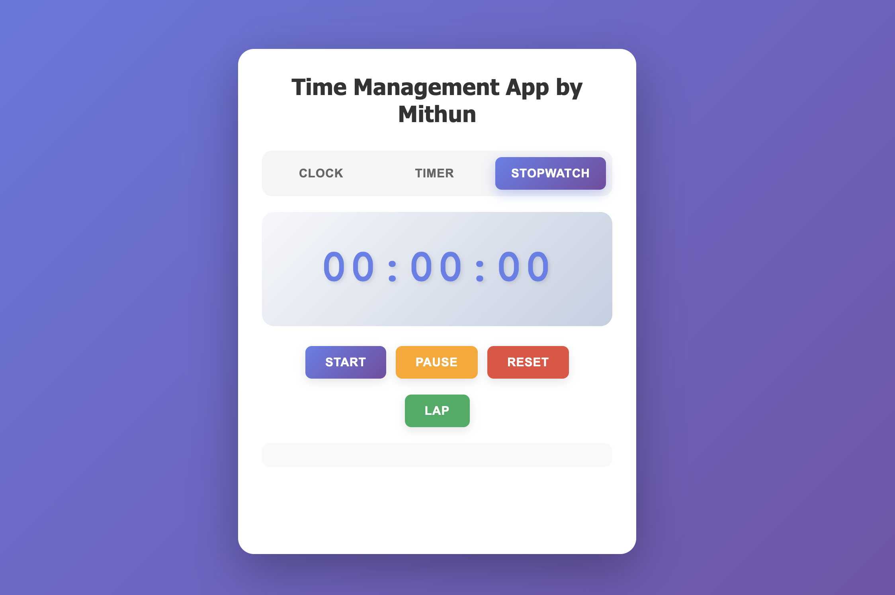

# ClockProject

A single-page web application that combines a live **Clock**, **Timer**, and **Stopwatch** with a modern tab-based UI.

## Project Snapshot

- UI quality: Good
- Code organization: Basic and readable
- Feature completeness: Partial
- Production readiness: Low (core gaps still open)

## Preview


### Clock Module



### Timer Module



### Stopwatch Module



## Feature Status

- Clock tab UI: Implemented
- Clock live update: Implemented
- 12/24 hour toggle: Implemented (needs behavior cleanup)
- Timer tab UI: Implemented
- Timer logic: Incomplete
- Stopwatch tab UI: Implemented
- Stopwatch start/pause/reset: Partially implemented
- Lap button logic: Missing

## Code Analysis (Professional Review)

Review scope:
- `index.html`
- `styles.css`
- `script.js`
- `README.md`

### High Severity Findings

1. Timer feature is incomplete/non-functional.
- Evidence: timer controls exist, but no complete event binding/countdown flow in `script.js`.
- Impact: Start/Pause/Reset do not complete expected countdown behavior.

2. Lap feature UI is present but not wired in JavaScript.
- Evidence: `#stopwatch-lap` and `#lap-list` exist in HTML, but no lap listener/append logic in JS.
- Impact: User-visible control appears broken.

### Medium Severity Findings

3. Stopwatch pause button mixes pause and play state behavior.
- Evidence: pause handler toggles labels and includes restart branch.
- Impact: Label/state mismatch can confuse users.

4. Clock format toggle logic does not align cleanly with checkbox semantics.
- Evidence: click-based toggling and text updates do not use checked-state mapping clearly.
- Impact: Inconsistent behavior and harder maintenance.

### Low Severity Findings

5. Clock render starts after first interval tick, not immediately on load.
- Impact: brief placeholder display on first paint.

6. Stopwatch counters rely on string-to-number coercion.
- Impact: works currently, but increases long-term bug risk.

7. Original README lacked onboarding depth.
- Impact: harder for new contributors to understand current status.

## Recommended Fix Roadmap

### Phase 1: Functional Completeness (Critical)

1. Implement full timer lifecycle:
- Bind `timer-start`, `timer-pause`, `timer-reset`.
- Track remaining seconds reliably.
- Prevent parallel intervals.
- Validate and clamp input values.

2. Implement stopwatch lap logging:
- Add listener on `#stopwatch-lap`.
- Append lap rows to `#lap-list` with sequence and time.

### Phase 2: UX and Behavior Consistency

3. Refactor stopwatch state management:
- Use explicit `isRunning` flag.
- Keep start, pause, and reset responsibilities clear.

4. Refactor clock format toggle:
- Use `change` event and `checked` state mapping.
- Keep label meaning consistent (state/action).

5. Call `clock()` once at initialization before `setInterval`.

### Phase 3: Maintainability

6. Normalize stopwatch/timer state to numeric types.
7. Organize script into modular feature sections.
8. Add lightweight manual test checklist.

## Local Run

1. Open `index.html` directly in a browser.
2. Or serve the folder with any static server.

## Project Structure

```text
ClockProject/
|- index.html
|- styles.css
|- script.js
|- README.md
|- CODE_ANALYSIS_REPORT.md
`- assets/
   `- images/
      |- dashboard-preview.svg
      |- clock-preview.svg
      |- timer-preview.svg
      `- stopwatch-preview.svg
```

## Notes

- Detailed standalone analysis is also available in `README.md`.
- Current priority should be Timer completion and Lap implementation before production use.
